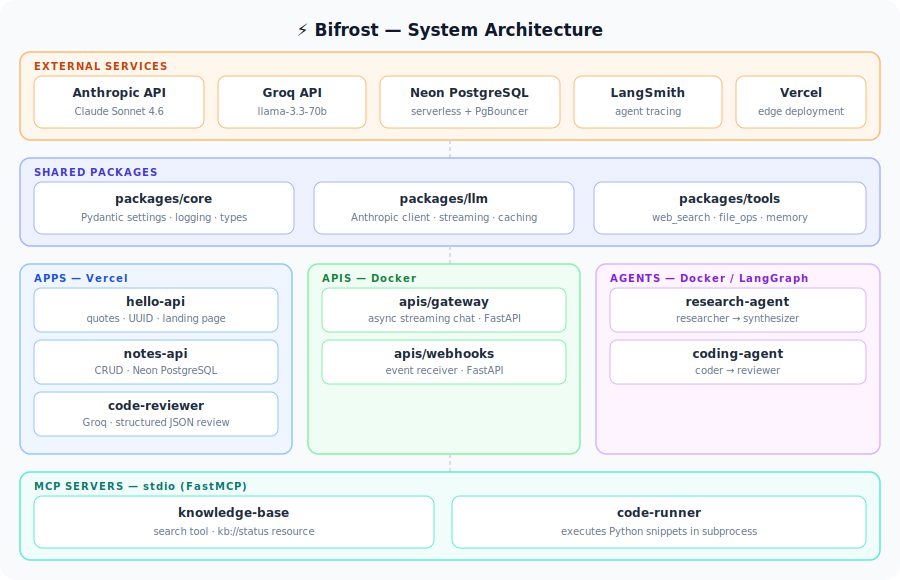

# ⚡ Bifrost

<p align="center">
  
  
  
  
  
  <br/>
  
  
  
</p>

<p align="center">
  A <code>uv</code>-powered Python monorepo for MCP servers, FastAPI backends, and LangGraph agents — like Turborepo but for Python.
</p>

---

## Architecture



---

## Documentation

| Doc | Description |
|---|---|
| [HLD](docs/HLD.md) | What Turborepo is, how this repo maps to it, system architecture, technology choices |
| [LLD](docs/LLD.md) | uv workspace mechanics, package internals, Vercel deployment design, how to add a new app |
| [GUIDE](docs/GUIDE.md) | How to create and deploy apps, agents, APIs, and MCP servers |

## Stack

| Layer | Tool |
|---|---|
| Package manager | `uv` (workspace mode) |
| Backend servers | FastAPI |
| MCP servers | FastMCP |
| Agent framework | LangGraph |
| LLM SDK | Anthropic Python SDK |
| Lockfile | `uv.lock` (single, at root) |

## Structure

```
bifrost/
├── packages/
│   ├── core/       # pydantic settings, logging, shared types
│   ├── llm/        # Anthropic client, streaming helpers
│   └── tools/      # web search, file ops, memory
├── mcp-servers/
│   ├── knowledge-base/
│   └── code-runner/
├── apis/
│   ├── gateway/    # main FastAPI backend
│   └── webhooks/
├── agents/
│   ├── research-agent/   # LangGraph multi-step researcher
│   └── coding-agent/     # LangGraph code writer + reviewer
└── scripts/
    └── seed_db.py
```

## Quickstart

```bash
# Install uv
curl -LsSf https://astral.sh/uv/install.sh | sh

# Clone and sync
git clone <repo>
cd bifrost
cp .env.example .env   # fill in ANTHROPIC_API_KEY
uv sync

# Run the gateway API
uv run --package gateway uvicorn src.main:app --reload

# Run the research agent
uv run --package research-agent python src/main.py "What is LangGraph?"

# Start the knowledge-base MCP server (stdio)
uv run --package knowledge-base python src/server.py
```

## Common uv commands

```bash
# Add a dep to a specific app
uv add httpx --package gateway

# Add a dep to a shared package
uv add tiktoken --package llm

# Run a one-off script
uv run scripts/seed_db.py
```

## Adding a new app

```bash
# 1. Create the folder
mkdir -p agents/my-new-agent/src

# 2. Copy pyproject.toml from an existing agent and update name/deps

# 3. uv picks it up automatically (glob members = ["agents/*"])
uv sync

# 4. Add Dockerfile + .github/workflows/deploy-my-new-agent.yml when ready
```

## MCP server config (Claude Desktop / Claude Code)

```json
{
  "mcpServers": {
    "knowledge-base": {
      "command": "uv",
      "args": ["run", "--package", "knowledge-base", "python", "src/server.py"]
    },
    "code-runner": {
      "command": "uv",
      "args": ["run", "--package", "code-runner", "python", "src/server.py"]
    }
  }
}
```
